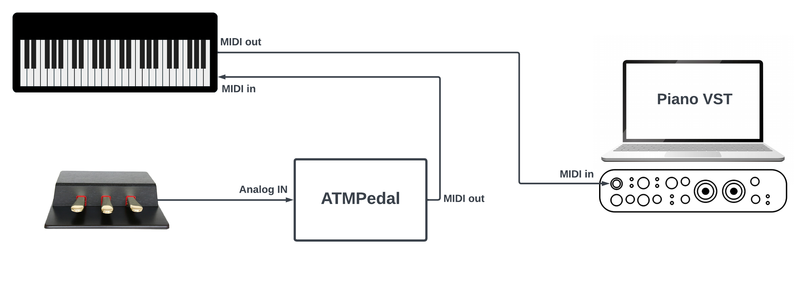

# ATMPedal, an open source analog to MIDI pedal adapter

## Overview

This opensource hardware project lets you connect up to 3 expression pedals and transform their analog signal into continuous MIDI data.

It was originally designed to use a Kawai GFP-3 triple pedal unit with a Kawai VPC1 MIDI controller. But it can easily be adapted for use with other pedal models and any digital piano (as long as it has MIDI input).

The hardware is a shield for an ESP32-Devkit-C development board (because I had some). The firmware is based on Arduino platform.

This repository was created to share useful information that I wish I had, as well as the hardware and software solution that I personally used. As with any DIY electronics project, be aware that there is a risk of damaging your hardware if you make a mistake. If you have no technical skills in electronics or programming, I advise you not to use this project. Please read the [hardware LICENSE](./hardware/LICENSE) and [firmware LICENSE](./firmware/LICENSE) before using the project.

## Use cases

Several options are available, depending on your situation:

### Plug it to your DP's MIDI IN port

If your digital piano has a unused MIDI IN port, you can plug the ATMPedal to it.
Your digital piano will (in most cases) automatically transfer the midi events to your computer.

If you use the internal sound engine of your digital piano, you can plug it like this:

### Plug it to your computer MIDI IN port

If you plug the ATMPedal to your computer directly, you can use the MIDI pedal events in your virtual instruments.

## Project structure

The project is structured as follows:

- [firmware](./firmware): a PlatformIO / Arduino project to build the firmware.
- [hardware](./hardware): the hardware design design (schematic, PCB and POM file).
- [receipes](./receipes): concrete examples of how this project can be used:
  * [Kawai "Grand Feel" pedals (GFP-3, F-302...)](./receipes/kawai_grand_feed_pedals/README.md)
  * Feel free to contribute to complete the list!

## Demonstration

FIXME

