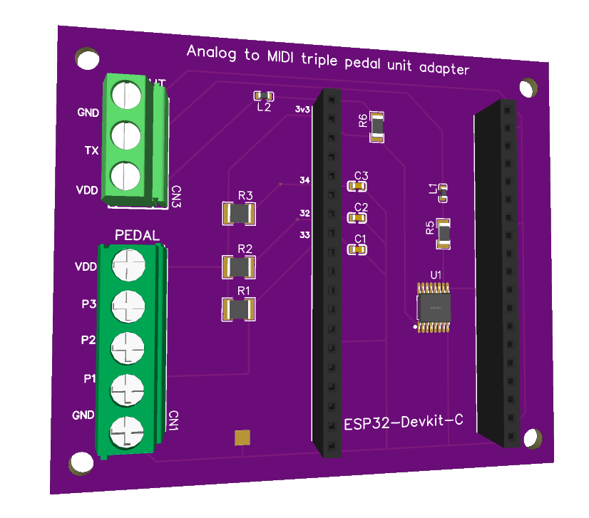
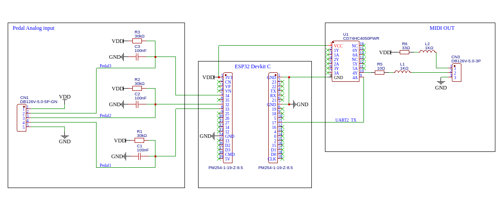

# ATMPedal - Hardware

## Overview

The hardware is a shield for an ESP32-Devkit-C development board.

The 3P screw connector at top left is used to connect the MIDI OUT connector. I didn't install a DIN 5 connector directly on the board, as it's often more practical to use a panel connector. And if you prefer to have the midi output on a 2.5mm jack, that's also possible.

The 5P screw connector at bottom left is used to connect the analog pedal. Up to 3 pedals can be connected here. I've deliberately used a screw connector so that any type of connector can be used. And I have a preference for panel-mounted connectors.

## Schematic

([PDF version](./schematic.pdf))

### Pedal analog input

Each of the 3 pedals' analog inputs is connected to an ESP32 GPIO, in order to use the analog-to-digital converter (ADC 1).

The ESP32 ADC is quite noisy. To help correct this (in addition to a software solution), a 0.1µF capacitor is used for each input, as recommended in [Espressif documentation](https://docs.espressif.com/projects/esp-idf/en/v4.2/esp32/api-reference/peripherals/adc.html#minimizing-noise).

A pullup resistor is also connected to each input, to avoid reading random values when no pedal is connected.

### ESP32 Devkit C

I'm using a `ESP-32 Dev Kit C V4` provided by `AZ-Delivery`, but I think you can use any `ESP32 Dev Kit C`.

### MIDI output

For this part, I followed to the letter the recommendations of **MIDI 1.0 Electrical Specification Update [2014]**, notably :

- A non inverting buffer (`74HC4050`) is used to protect the microcontroller in case of faulty connection.

- Ferrite beads (1kΩ at 100MHz) are used to improve EMI/EMC performance.

## PCB

You can download the [Gerber file here](./gerber.zip).

Here is a preview of the top and bottom of this 2-layer PCB. 

This is my first PCB design, constructive comments are welcome.

## Components list

- [BOM file](./bom.csv)
- [Pick and place file](./pickandplace.csv)

