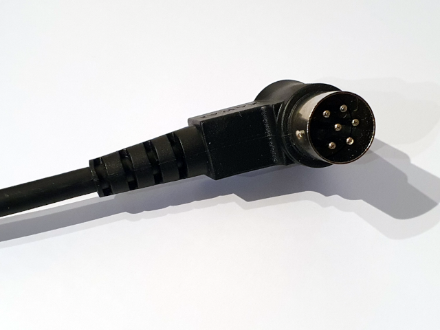
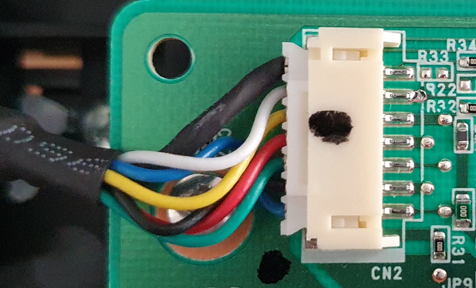
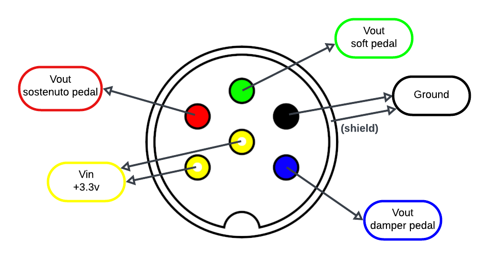
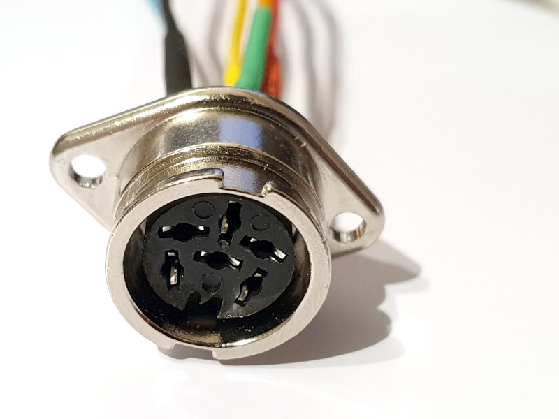
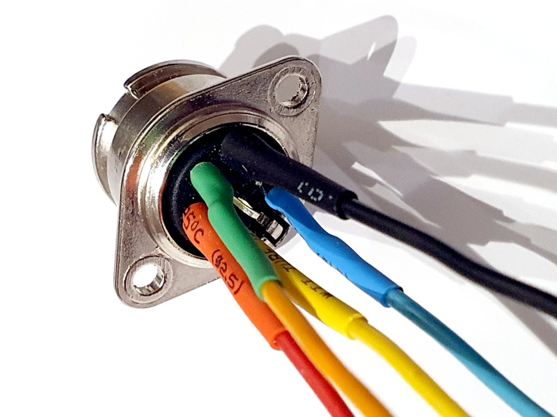
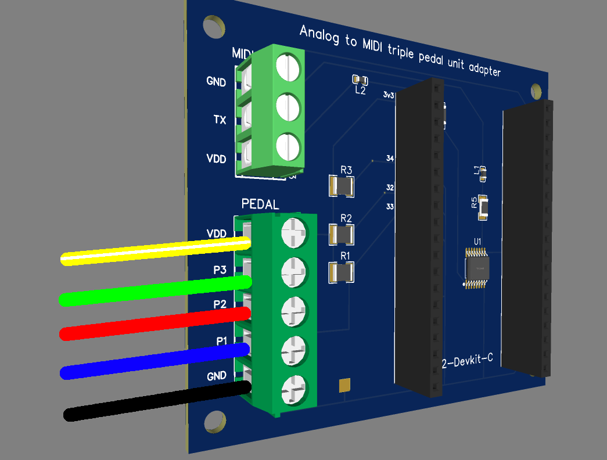

# ATMPedal on Kawai "Grand Feel" Pedals

This page explains how to use the following Kawai pedals with ATMPedal:

- Kawai F-302
- Kawai GFP-3
- Kawai F-351 (to be confirmed, but it use the same connector)

## Introduction

I originally created this project so that I could use a Kawai "Grand Feel" pedal (F-302) with a Kawai VPC1 MIDI, in a custom cabinet.

The feel of these pedals is very realistic. They're robust. And they also have the advantage of using optical (non-contact) sensors to detect pedal movement.

But they use a proprietary connector. They are therefore only compatible with certain recent Kawai digital piano models.


## Pedal specifications

### Connectors

These triple pedal units use a male 6 Pin DIN Plug 240 degree:



At the other end of the cable, a 7-pin connector is connected to the PCB:




### Pinout

After a few measurements, here's what I was able to conclude about the pinout of the DIN 6 male connector:



I used the same color code than the wires seen on the previous picture.

A few notes:

- The 2 `black` wires are connected to the **ground**. One of them (the biggest) is the shield of the connector, the other one is connected to the black pin.

- About the `yellow` and `white` wires: I can't tell which pin corresponds to which wire color, because the two wires seem to be connected to each other. That's why I put the colors yellow and white on both pins.
Anyway, these pins correspond to the **positive voltage supply**. You only need to connect one of them to a **3.3v** supply.

- The `red` wire is the voltage output of the sostenuto (middle) pedal. When the pedal is idle, the voltage is equal to **Vin** (3.3v). The further the pedal is depressed, the closer it is to 0v.

- The `green` wire is the voltage output of the soft (left) pedal. Behavior is the same as for other pedals.

- The `blue` wire is the voltage output of the damper (right) pedal. Behavior is the same as for other pedals.


## Connecting to the ATMPedal

My aim was not to make any destructive modifications to the original pedal. So I bought a DIN 6 female connector ([this one](https://docs.rs-online.com/2e43/0900766b81579ba1.pdf)) so I could plug into it.

Another solution was to find the same connector to connect directly to the circuit board, but I preferred not to touch this connector...

Here is the result:






On this picture, two pins are not connected :

- the yellow/white pin in the center (no needed, as seen before)
- the shield (I should connect it to the ground)


Then, you just have to connect the wires to the PEDAL (5 pin) screw connector of the ATMPedal board:




### Demo

[](https://www.youtube.com/watch?v=zMIhc3xMuQI)


### Firmware configuration

It works with the default values configured in `main.cpp`:

- MIDI output is sent on MIDI channel 1
- The sustain / damper pedal uses MIDI CC 64 and is connected to the pin 33 of the ESP32
- The sostenuto pedal uses MIDI CC 66 and is connected to the pin 32 of the ESP32
- The soft / una corda pedal uses MIDI CC 67 and is connected to the pin 34 of the ESP32


The configuration can be changed by editing the following lines in `main.cpp` :

```c
// Default MIDI channel for pedal CC events
#define DEFAULT_MIDI_CHANNEL 1

// Sustain
#define PEDAL1_PIN 33
#define PEDAL1_MIDI_CC 64
#define PEDAL1_MIDI_CHANNEL DEFAULT_MIDI_CHANNEL

// Sostenuto
#define PEDAL2_PIN 32
#define PEDAL2_MIDI_CC 66
#define PEDAL2_MIDI_CHANNEL DEFAULT_MIDI_CHANNEL

// Una corda
#define PEDAL3_PIN 34
#define PEDAL3_MIDI_CC 67
#define PEDAL3_MIDI_CHANNEL DEFAULT_MIDI_CHANNEL
```